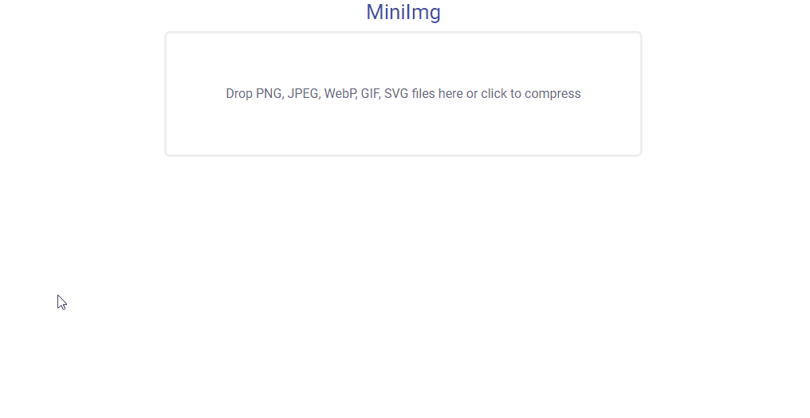

# MiniImg

**MiniImg** is a web-based application for compressing and optimizing PNG, JPEG, WebP, GIF, and SVG images using
various command line tools.



# Prepare environment

### Requirements

MiniImg requires the following packages:

* PHP 8
* Apache 2.4
* Composer
* Node.js and npm

For images compression and optimization you need to have the following tools:

* optipng
* pngquant
* jpegoptim
* cwebp
* gifsicle
* svgo

### Install optimizers

On Ubuntu/Debian, optimizers can be installed using the following commands:

```shell
sudo apt update
sudo apt install -y optipng
sudo apt install -y pngquant
sudo apt install -y jpegoptim
sudo apt install -y webp
sudo apt install -y gifsicle
sudo npm install -g svgo
```

On Windows, prebuilt binaries can be downloaded using the following links:

* [optipng](https://sourceforge.net/projects/optipng/files/OptiPNG/optipng-0.7.7/optipng-0.7.7-win32.zip/download)
* [pngquant](https://pngquant.org/pngquant-windows.zip)
* [jpegoptim](https://raw.githubusercontent.com/imagemin/jpegoptim-bin/master/vendor/win32/jpegoptim.exe)
* [webp](https://storage.googleapis.com/downloads.webmproject.org/releases/webp/libwebp-1.2.1-windows-x64.zip)
* [gifsicle](https://eternallybored.org/misc/gifsicle/releases/gifsicle-1.92-win64.zip)
* svgo can be installed with command: `npm install -g svgo`

Make sure your binaries are added to PATH environment variable that allows to locate executables from the
command line.

### Configure PHP

* Set the value of `upload_max_filesize` and `post_max_size` in your `php.ini` to control upload file size:

```ini
upload_max_filesize = 40M
post_max_size = 40M
```

### Configure Apache

* A `mod_rewrite` module should be enabled for Apache. On Ubuntu/Debian, run the following commands:

```shell
sudo a2enmod rewrite
sudo service apache2 restart
```

* Directory root should be pointed to `public` directory. For example, you can edit the default virtual hosts
  that provided on Ubuntu/Debian:

```shell
sudo nano /etc/apache2/sites-available/000-default.conf
```

Example of configuration file:

```apacheconf
<VirtualHost *:80>
    ServerAdmin webmaster@localhost
    DocumentRoot /var/www/html/public

    <Directory /var/www/html/public>
        Options Indexes FollowSymLinks
        AllowOverride all
        Require all granted
    </Directory>

    ErrorLog ${APACHE_LOG_DIR}/error.log
    CustomLog ${APACHE_LOG_DIR}/access.log combined
</VirtualHost>
```

# Install MiniImg

* Download MiniImg:
  * `curl -Lo mini-img.tar.gz https://github.com/lindevs/mini-img/archive/master.tar.gz`

* Extract files to your www directory:
  * Linux: `tar xf mini-img.tar.gz --strip-components=1 -C /var/www/html`
  * Windows: `tar xf mini-img.tar.gz --strip-components=1 -C C:\wamp64\www`

* Go to MiniImg root directory:
  * Linux: `cd /var/www/html` 
  * Windows: `cd C:\wamp64\www`

* Install composer packages:
  * `composer install --optimize-autoloader --no-dev`

* Copy `.env.example` file to `.env`:
  * Linux: `cp .env.example .env`
  * Windows: `copy .env.example .env`

* Open `.env` file and modify the following options:

```ini
APP_ENV=prod
APP_DEBUG=false
```

* Generate application key:
  * `php artisan key:generate`

* Cache the bootstrap files:
  * `php artisan optimize`

* Change directory permissions (only Linux):
  * Only Linux: `chmod -R 777 storage bootstrap/cache public/uploads`

* Install npm packages:
  * `npm install`

* Compile assets:
  * `npm run prod`

* Open browser and navigate to [http://localhost](http://localhost)

**Note:** To run commands in Linux requires root or user with sudo privileges.

# Development

* Go to your www directory:
  * Linux: `cd /var/www/html`
  * Windows: `cd C:\wamp64\www`

* Clone MiniImg repository:
  * `clone https://github.com/lindevs/mini-img.git`

* Install composer packages:
  * `composer install`

* Install npm packages:
  * `npm install`

* Compile assets:
  * `npm run dev`

* Run command if you want automatically recompile your assets when it detects files changes:
  * `npm run watch`

**Note:** To run commands in Linux requires root or user with sudo privileges.

# License

The code in this repository is licensed under the [Apache License 2.0](LICENSE).
